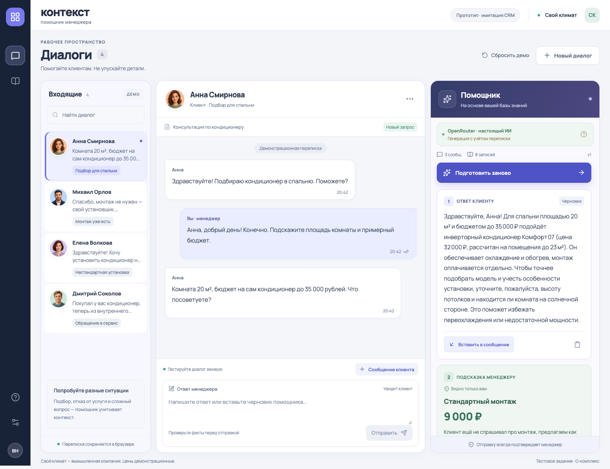
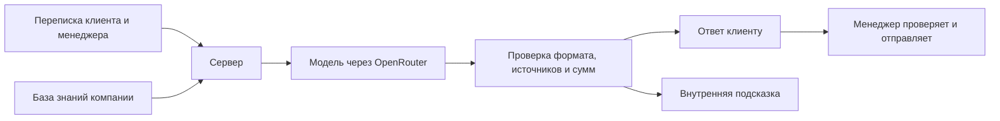

<div align="center">

# Контекст

### Помощник менеджера: ответ клиенту и уместная допродажа

Прототип для тестового задания **О-комплекс** · Магазин кондиционеров «Свой климат»

**React · TypeScript · Express · OpenRouter**

[Как работает](#как-работает) · [Запуск](#запуск) · [Карта проекта](#карта-проекта) · [Текст для демонстрации](#текст-для-демонстрации) · [Проверки](#проверки)

</div>



## Видеодемонстрация

**[▶ Смотреть / скачать демонстрацию автора](docs/video/demo.mov)** · 2:56 · QuickTime MOV · около 77 МиБ

Запись рабочего экрана от 29 сентября 2026 года. Если GitHub предлагает только скачивание, откройте файл в QuickTime или VLC. Исходная запись добавлена без перекодирования.

## Что делает сервис

Менеджеру не нужно каждый раз искать товар, сверять условия и писать ответ с нуля. «Контекст» читает переписку, получает справочник компании и готовит два отдельных блока:

| Для клиента | Для менеджера |
|---|---|
| Вежливый ответ с опорой на товары, цены и условия из базы | Подсказка, какую дополнительную услугу уместно предложить и почему |
| Можно вставить в редактор, изменить и отправить | Остаётся внутренней; автоматически клиенту не отправляется |

**Пример:** клиент ищет кондиционер для спальни 20 м². Помощник может предложить подходящую модель из базы, уточнить условия помещения и отдельно подсказать менеджеру спросить о монтаже. Если клиент уже отказался от установки — повторять предложение не нужно.

> Реальная генерация подключена через **OpenRouter**. CRM имитируется — такой формат и ниша согласованы с работодателем. Компания, клиенты и цены вымышленные. Сообщения реальным людям не отправляются.

## Как работает



1. Менеджер выбирает диалог или добавляет обращение клиента.
2. По кнопке **«Подготовить ответ»** сервер берёт актуальную базу и историю разговора.
3. Модель получает их вместе с инструкциями и возвращает результат по JSON Schema.
4. Сервер проверяет структуру, существование источников и часть денежных сумм. Дополнительные правила учитывают распознанные отказы и жалобы.
5. Менеджер открывает источники, проверяет ответ и сам решает, что отправить.

### Что считается базой знаний

Это восемь редактируемых записей: **три кондиционера, монтаж, обслуживание, гарантия, доставка и правила консультации**. У записи есть название, факты и условия, тип, а при необходимости — цена и площадь помещения.

Начальные данные находятся в [shared/seed.ts](shared/seed.ts). При первом запуске сервер создаёт рабочий файл `data/knowledge.json`. Изменения через раздел **«База знаний»** сохраняются в нём и используются при следующей генерации. Для такого небольшого справочника в запрос передаётся вся база: отдельное векторное хранилище не требуется.

### Правила помощника

- Использовать факты из базы; неизвестные цены, характеристики и сроки уточнять.
- Учитывать предыдущие сообщения, уже сделанные предложения и отказы клиента.
- При жалобе сначала помогать с проблемой, без допродажи.
- Отделять ответ клиенту от внутренней рекомендации менеджеру.
- После изменения переписки или базы готовить новый ответ.
- При ошибке провайдера показывать ошибку, а не незаметно подставлять demo.

Проверки снижают риск ошибок, но не доказывают достоверность каждого утверждения модели. Итоговый текст проверяет менеджер.

## Запуск

Нужны **Node.js 22.12+** и npm. Проверено на Node.js 22.16.0 и macOS.

```sh
git clone https://github.com/vladnaitl18-web/o-complex-assistant.git
cd o-complex-assistant
npm ci
cp .env.example .env
npm run build
npm start
```

Откройте **[http://127.0.0.1:3001](http://127.0.0.1:3001)**. Сервер должен оставаться запущенным. Остановка — `Ctrl+C`.

На macOS после установки зависимостей можно запускать приложение двойным щелчком по [start.command](start.command).

### Настоящие ответы через OpenRouter

По умолчанию `.env.example` включает **demo**: локальные правила для проверки интерфейса без ключа. Для ИИ измените свой `.env`:

```dotenv
AI_PROVIDER=openrouter
OPENROUTER_API_KEY=ваш_ключ
OPENROUTER_API_KEY_BACKUP=
OPENROUTER_MODEL=nvidia/nemotron-3-super-120b-a12b:free
```

Перезапустите сервер. На панели помощника появится **«OpenRouter · настоящий ИИ»**, а в настройках — выбранная модель.

| Параметр | Назначение |
|---|---|
| `AI_PROVIDER` | `openrouter` — реальная модель; `demo` — локальные правила; `yandex` — альтернативный адаптер |
| `OPENROUTER_API_KEY` | Основной ключ, только на сервере |
| `OPENROUTER_API_KEY_BACKUP` | Необязательный резерв; одна попытка при HTTP 401 основного ключа |
| `OPENROUTER_MODEL` | Идентификатор модели OpenRouter |
| `PORT` / `HOST` | По умолчанию `3001` и `127.0.0.1` |

OpenRouter ограничен бесплатными endpoint через `max_price=0`. Их доступность и квоты зависят от провайдера. Ответ может занять до минуты. Ошибка 429 не запускает перебор ключей. При генерации история и база передаются выбранному провайдеру.

**Ключи в репозиторий не входят.** Каждая новая установка настраивает собственный `.env`.

<details>
<summary>Альтернативный адаптер Yandex AI Studio</summary>

Он сохранён в коде, но не используется в основной конфигурации. Живой API Яндекса не проверялся; для адаптера есть автоматические тесты.

```dotenv
AI_PROVIDER=yandex
YANDEX_API_KEY=ваш_ключ
YANDEX_FOLDER_ID=ваш_каталог
```

При необходимости задайте полный `YANDEX_MODEL_URI`. Запросы тарифицируются по условиям аккаунта Яндекса.

</details>

### Разработка

```sh
npm run dev
```

Интерфейс — `http://127.0.0.1:5173`, API — `http://127.0.0.1:3001`. При изменении `.env` перезапустите сервер. Переписка хранится отдельно для каждого адреса и порта браузера.

## Карта проекта

```text
o-complex-assistant/
├── src/
│   ├── App.tsx                # Диалоги, помощник, редактор базы и текст выступления
│   ├── style.css              # Дизайн, адаптивность и состояния элементов
│   └── main.tsx               # Вход в React и локальные шрифты
├── server/
│   ├── index.ts               # Запуск локального сервера
│   ├── app.ts                 # HTTP API, валидация запросов и обработка ошибок
│   ├── config.ts              # Чтение настроек провайдера из окружения
│   ├── assistant.ts           # OpenRouter / Yandex, промпт и проверка ответа
│   ├── demo.ts                # Явный демонстрационный режим по правилам
│   └── store.ts               # Чтение и атомарное сохранение базы знаний
├── shared/
│   ├── schema.ts              # Общие типы и схемы Zod
│   └── seed.ts                # 8 записей базы и 4 демонстрационных диалога
├── public/
│   ├── avatars/               # Четыре портрета, созданные ImageGen
│   └── favicon.svg            # Значок приложения
├── data/                      # Рабочая база создаётся здесь; JSON не входит в Git
├── tests/
│   ├── assistant.test.ts      # Подбор, провайдеры и проверки ответа
│   └── api.test.ts            # API, хранение, ошибки и ограничения
├── e2e/app.spec.ts             # Браузерные сценарии Playwright
├── scripts/
│   ├── check-live.ts          # Проверка четырёх диалогов на настоящей модели
│   └── record-demo.ts         # Запись интерфейса в режиме правил
├── docs/
│   ├── TZ.md                  # Исходное ТЗ и согласованный объём
│   ├── ARCHITECTURE.md         # Устройство, API и ограничения
│   ├── DEMO_SCRIPT.md          # Текст для выступления
│   ├── TEST_REPORT.md          # Результаты тестов и живых проверок
│   ├── AVATARS.md              # Промпты сгенерированных портретов
│   ├── PLAN.md                 # План и история готовности
│   ├── screenshots/            # Снимки настольного и мобильного интерфейса
│   └── video/                 # demo.mov — запись автора; context-demo.webm — ранний demo
├── .env.example               # Шаблон настроек без секретов
├── AGENTS.md                  # Правила работы над проектом
├── start.command              # Запуск на macOS
├── package.json               # Команды и зависимости
└── package-lock.json          # Зафиксированные версии зависимостей
```

### Куда идти, чтобы изменить…

| Задача | Файл или раздел |
|---|---|
| Товары, цены, условия | Раздел «База знаний»; начальные данные — [shared/seed.ts](shared/seed.ts) |
| Инструкции модели и проверку результата | [server/assistant.ts](server/assistant.ts) |
| Провайдера и модель | Локальный `.env`; чтение параметров — [server/config.ts](server/config.ts) |
| Интерфейс и текст по кнопке «?» | [src/App.tsx](src/App.tsx) |
| Цвета, отступы, адаптивность | [src/style.css](src/style.css) |
| Контракт ответа и ограничения полей | [shared/schema.ts](shared/schema.ts) |
| Сохранение базы | [server/store.ts](server/store.ts) |
| Регрессионные сценарии | [tests/](tests/) и [e2e/](e2e/) |

### Хранение данных

| Данные | Где находятся |
|---|---|
| Рабочая база знаний | `data/knowledge.json`, на сервере |
| Отправленные сообщения | `localStorage` браузера, ключ `o-complex-workspace-v1` |
| Черновики и результаты генерации | Память страницы до перезагрузки |
| Ключи API | Серверный `.env`, исключён из Git |

Кнопка «Сбросить демо» восстанавливает демонстрационные диалоги после подтверждения и не меняет базу знаний. Шрифты и аватары загружаются локально.

## Текст для демонстрации

**Около 1–2 минут.** Этот текст также открывается по кнопке **«?» → «О сервисе»** в приложении; его можно скопировать. Демонстрацию действий проводит автор.

> Я сделал «Контекст» — помощника для менеджера магазина кондиционеров. Он помогает быстрее отвечать клиентам и замечать, когда уместно предложить дополнительную услугу. Для тестового задания здесь создана имитация CRM: реальные сообщения клиентам не отправляются.
>
> У сервиса есть небольшая база знаний — справочник с товарами, ценами, услугами и правилами компании. Менеджер может редактировать её прямо в приложении. После сохранения новые ответы используют обновлённые сведения.
>
> По кнопке «Подготовить ответ» помощник получает историю разговора и базу знаний. Он готовит два отдельных блока: вежливый ответ клиенту и внутреннюю подсказку менеджеру с объяснением, что можно предложить дополнительно.
>
> Например, к подходящему кондиционеру можно предложить монтаж. Но помощник должен учитывать предыдущие сообщения: не повторять предложение после отказа, при жалобе сначала помогать, а если сведений не хватает — уточнять их, а не выдумывать цену или условия.
>
> Под ответом можно открыть использованные записи базы. Менеджер проверяет текст, при необходимости меняет его и сам отправляет в диалог. Внутренняя подсказка автоматически клиенту не отправляется.
>
> Ответы здесь генерирует настоящая языковая модель через OpenRouter. Сервер дополнительно проверяет формат ответа, ссылки на базу и указанные суммы. При этом окончательная проверка остаётся за менеджером.
>
> Для разработки я использовал Codex: он помог подготовить интерфейс, серверную логику и тесты. Аватары клиентов сгенерированы с помощью ImageGen.

## Проверки

| Проверка | Подтверждённый результат |
|---|---|
| TypeScript и production-сборка | Пройдены |
| Vitest + Supertest | 45 тестов |
| Playwright | 15 браузерных сценариев в изолированном demo |
| Настоящий OpenRouter | 4 демонстрационных диалога + запрос из Chrome |
| Адаптивность | 1440, 1280, 768 и 390 px |

Подробности и ограничения — в [отчёте проверки](docs/TEST_REPORT.md).

```sh
npm run check        # Сборка + unit/API + браузерные тесты
npm run check:live   # 4 настоящих запроса выбранному провайдеру
npm run format      # Форматирование исходников
```

Браузерные тесты по умолчанию используют Google Chrome и отдельный сервер на порту `4173`. Для компьютера без Chrome:

```sh
npx playwright install chromium
PLAYWRIGHT_CHANNEL=chromium npm run test:e2e
```

Переменную в Windows нужно задать средствами используемой оболочки. E2E не изменяют рабочую базу или переписку пользователя. Живой прогон требует доступ к модели и ручную оценку смысла ответа.

### Сценарии для самостоятельной проверки

| Клиент | Что проверять |
|---|---|
| Анна | Подбор по площади и бюджету, монтаж отдельной подсказкой |
| Михаил | Учёт отказа от монтажа, отсутствие повторной продажи |
| Елена | Нестандартная установка, уточнение условий вместо выдуманной цены |
| Дмитрий | Жалоба, помощь с обращением в сервис без допродажи |

Также можно изменить цену в базе, добавить новое сообщение, отредактировать черновик и проверить сохранение переписки после перезагрузки.

## Границы прототипа

Приложение запускается локально и слушает только loopback. GitHub хранит исходный код; загрузка в репозиторий сама по себе не размещает сервис в интернете. Многопользовательская авторизация, синхронизация между браузерами и реальная AmoCRM не реализованы.

Ограничения: до 40 диалогов, 80 сообщений в каждом, 4 000 символов на сообщение и 30 записей базы. JSON-хранилище рассчитано на один процесс. Перед внешним размещением нужны авторизация, серверное хранение истории и ограничения доступа к редактированию базы.

[Предварительное видео](docs/video/context-demo.webm) показывает **режим правил**, с титрами и без озвучки. Оно сохранено как промежуточный материал и не представляет текущую генерацию OpenRouter.

## Документация и источники

[ТЗ](docs/TZ.md) · [Архитектура и API](docs/ARCHITECTURE.md) · [Текст выступления](docs/DEMO_SCRIPT.md) · [Отчёт проверки](docs/TEST_REPORT.md) · [Промпты аватаров](docs/AVATARS.md)

Интеграция: [OpenRouter Authentication](https://openrouter.ai/docs/api_reference/authentication), [Structured Outputs](https://openrouter.ai/docs/guides/features/structured-outputs), [Provider Routing](https://openrouter.ai/docs/guides/routing/provider-selection).
